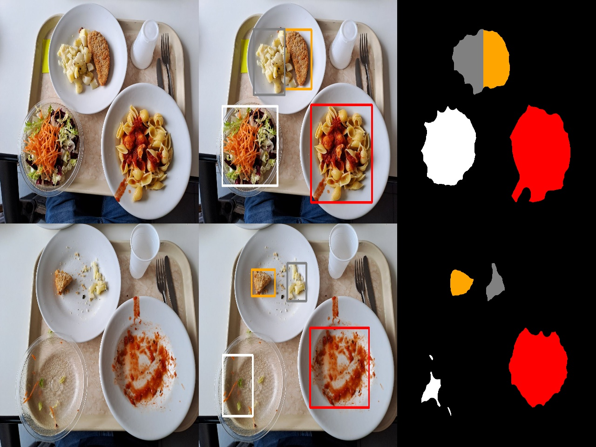

# FoodLeftoverEstimation

This project consists of a C++ Computer Vision system to monitor food consumption and waste in canteens. The system has been developed exploiting the OpenCV 4.5.2 library (https://opencv.org/blog/opencv-4-5-2/).

The systems is able to segment and detect the following foods:
- First dishes: pasta with pesto, pasta with tomato sauce, pasta with meat sauce, pasta with clams and mussels, pilaw rice with peppers and peas;
- Second dishes: grilled pork cutlet, fish cutlet, rabbit, seafood salad;
- Side dishes: beans, basil potatoes, salad, bread.

## Input and Output ##

*Input of the system*: one image of the tray before the meal and one after the meal.

*Output of the system*: the detection bounding boxes, the segmentation masks and the estimation of food quantities/leftovers of the given meal.



```
food_image:
	2. pasta with tomato sauce
	7. fish cutlet
	11. basil potatoes
	12. salad

leftover:
	2. pasta with tomato sauce
	7. fish cutlet
	11. basil potatoes
	12. salad

2. pasta with tomato sauce
	Before amount = 116795
	After amount = 91903
	Leftover amount = 24892
7. fish cutlet
	Before amount = 35856
	After amount = 12110
	Leftover amount = 23746
11. basil potatoes
	Before amount = 38175
	After amount = 9927
	Leftover amount = 28248
12. salad
	Before amount = 87716
	After amount = 9293
	Leftover amount = 78423
```

## Project structure ##

The structure of the project:
- `data` contains some parameter files needed for the food recognition task;
- `include` contains the C++ header files;
- `input` contains the image dataset and the ground-truth;
- `src` contanins the C++ source files.

## Usage ##

In order to compile the project:
- Install CMake >= 2.8.12 (https://cmake.org/);
- Install OpenCV 4.5.2 (https://opencv.org/blog/opencv-4-5-2/);
- Create a `build` folder in the main project directory;
- Move to the `build` folder;
- Use CMake commands `cmake ..` and `make` to build.

Once the project has been built:
- Use `./main <before image> <after image>` to run the system, an output folder with masks will be created and estimates will be printed to console;
- Use `./mainTest <before image> <after image>` to run the system in test mode, in addition to the standard one the output will be compared with the ground-truth to provide the following metrics: mIoU (mean Intersection over Union), mAP (mean Avergae Precision) and LED (Leftover Estimation Difference).
